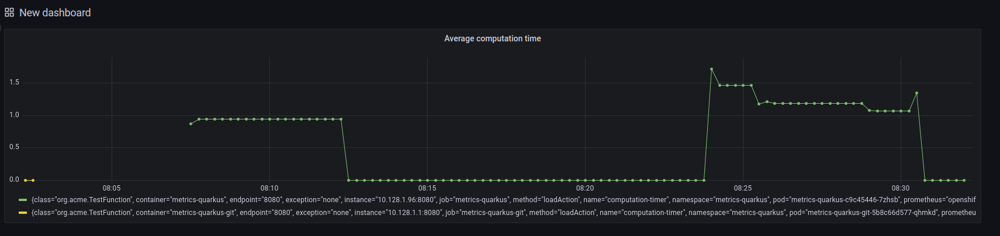

# metrics-tester Project

This project uses Quarkus, the Supersonic Subatomic Java Framework.

To easily get the app up & running:

    oc new-project metrics-quarkus
    oc new-app --name metrics-quarkus --as-deployment-config=false java:openjdk-17-ubi8~https://github.com/kubealex/metrics-quarkus.git
    oc expose svc metrics-quarkus
    oc apply -f https://raw.githubusercontent.com/kubealex/metrics-quarkus/master/ocp/servicemonitor.yaml -f https://raw.githubusercontent.com/kubealex/metrics-quarkus/master/ocp/cluster-monitoring-config-map.yaml

After the build ends, you can test the endpoint via:

    for i in {1..20}; do curl -k https://$(oc get route -n test-building metrics-quarkus -o jsonpath='{.spec.host}')/run; done

The app exposes a *my-computation-timer* metric that measures the execution time of a simulated calculation in a range from 0-5000ms.

To check if metrics are exposed visit:

    echo https://$(oc get route -n openshift-console console -o jsonpath='{.spec.host})/monitoring/query-browser?query0=rate%28my_computation_timer_seconds_sum%5B5m%5D%29%2Frate%28my_computation_timer_seconds_count%5B5m%5D%29

And to see an example of average execution time in the last 5 minutes, you can try the query:

    rate(my_computation_timer_seconds_sum[5m])/rate(my_computation_timer_seconds_count[5m])

## Grafana setup

To test it, run Grafana in a podman container

    podman run -it -p 3000:3000 docker.io/grafana/grafana:latest

Login to [localhost:3000](localhost:3000) with credentials *admin/admin*.

Use [this gist](https://gist.github.com/kubealex/fa9e4a747bb0e4408ca14a5eb88236bd) to fetch required info to configure Prometheus datasource.

Usage:
    ./metrics-setup.sh grafana-view metrics-quarkus

Sample output:

    ~ ▓▒░ ./metrics-setup.sh grafana-view metrics-quarkus                                                                            ░▒▓ ✔  08:30:35
    serviceaccount/grafana-view created
    clusterrole.rbac.authorization.k8s.io/cluster-monitoring-view added: "grafana-view"
    ***************************************************************************************
    * ### Use these parameters when configuring the datasource in Grafana or querying via cURL ###
    * URL: https://thanos-querier-openshift-monitoring.apps.hub.ocpdemo.labs
    * Auth: Skip TLS Verify
    * Custom HTTP Headers:
    *  Header: Authorization
    *  Value: Bearer eyJhbGciOiJSUzI1NiIsImtpZCI6IlA5elhZTE9GNkUwRFBXTnBFQWlMVjhwMUdLbFBtMjJuQWpDYWNGME5TWVUifQ.eyJpc3MiOiJrdWJlcm5ldGVzL3NlcnZpY2VhY2NvdW50Iiwia3ViZXJuZXRlcy5pby9zZXJ2aWNlYWNjb3VudC9uYW1lc3BhY2UiOiJtZXRyaWNzLXF1YXJrdXMiLCJrdWJlcm5ldGVzLmlvL3NlcnZpY2VhY2NvdW50L3NlY3JldC5uYW1lIjoiZ3JhZmFuYS12aWV3LXRva2VuLWhoemdjIiwia3ViZXJuZXRlcy5pby9zZXJ2aWNlYWNjb3VudC9zZXJ2aWNlLWFjY291bnQubmFtZSI6ImdyYWZhbmEtdmlldyIsImt1YmVybmV0ZXMuaW8vc2VydmljZWFjY291bnQvc2VydmljZS1hY2NvdW50LnVpZCI6IjgwZDViYzQ4LThkYWItNGY3Ny1iZmEwLTk4ZGRmMDE2YzUwOCIsInN1YiI6InN5c3RlbTpzZXJ2aWNlYWNjb3VudDptZXRyaWNzLXF1YXJrdXM6Z3JhZmFuYS12aWV3In0.gn8L8hdehlLk_9I9efIbU5sOrekCi_7qmvh5Z7oMV0TX__EdhOAYKPk3ftCeTWAdtdCDuYXzWvfpMZUfRSn7dQcHVD8f1iGoy6d3eQgDbhiDVYUdCb8DtI4-IHFsYanpSzB_qrh54W8KYHwBvs5azDBNwFZP0_8oGOgnwe-ew4fW6X7Aab3yWPfedUyLxdR2iKew6Dz3SbZ0WuSMpFgd_AQVrQpbOI6SgsakjPiAJwt0x8ZmnnsNMgBgneyFrzHwe8T8zbZ03NbV8yqqZXSnV0bxmat7y3Z1XeZxQnu3eUf8wmm2IGzsZrp5WHC3GtfvnK-VSwSSK-I2tvYVXCgSBB7wVZ2MorvzPWxcgy7rfLMTTbr4QnlpMhaaKUev7wsDWQY9dYAIbDNWhduH2ocirK98xjC67EC3RJP4hODzf8sB0-ZAkVkUPPga0fH_Yuq9TcazVGT-OH1tomPR5xDvGbupE0ts2Glxul8EsWSMxojuCPddIcDQ4egljbOm0UDiQvax7keI5VNAaK3eBU2lsk11MLA6lBHCeAkFjRi_vm93rXmf1ft_H47XKZ2920G2DUI4E7-bG1P_IM6JbmUpTtiRG6s4RrPo57Iwbj0EUPUYmgM0OKtR-OhJ6_zqhCRoElEi9AYsBwpPbFWOCTYtBizrpChi1cOwVICn2LslxHc
    ***************************************************************************************

